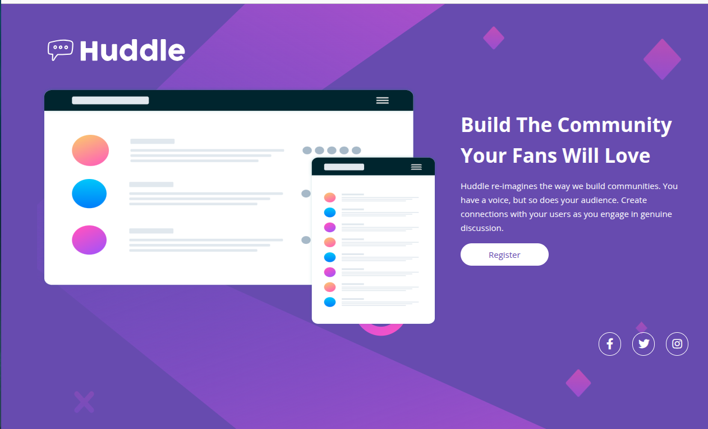

# Quest HTML + CSS Avançado

Esta é uma solução para o para o quest do curso [DevQuest Full-Stack](https://www.linkedin.com/school/devquest-dev-em-dobro/?originalSubdomain=br) baseado no desafio do Frontend Mentor - [Huddle landing page with a single introductory section](https://www.frontendmentor.io/challenges/huddle-landing-page-with-a-single-introductory-section-B_2Wvxgi0).

Os desafios do Frontend Mentor ajudam você a melhorar suas habilidades de codificação construindo projetos realistas.

### Screenshot

### Construído com

- HTML5
- CSS
- CSS Flex

### O que eu aprendi
- Posicionamento de elementos com displey flex.
- Utilização de Media Queries para ajustar estilo com base na tela do dispositivo

## Autor

- Website - [Vinícius Mendes Lima](https://viniciusml.vercel.app/)
- Frontend Mentor - [@ViniciusMendesLima](https://www.frontendmentor.io/profile/ViniciusMendesLima)
- Linkedin - [Vinícius Mendes Lima](www.linkedin.com/in/vinicius-mendes-lima)

